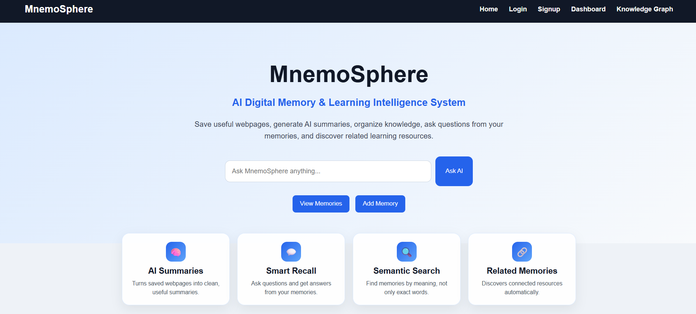
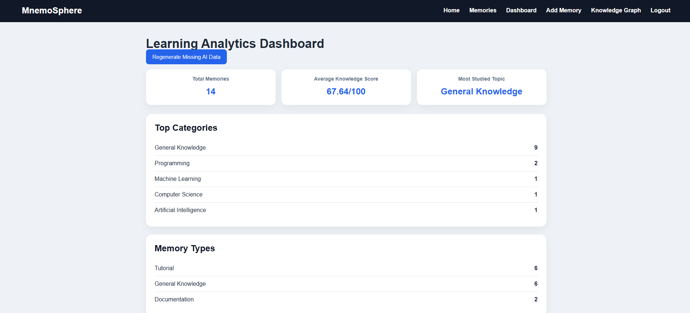
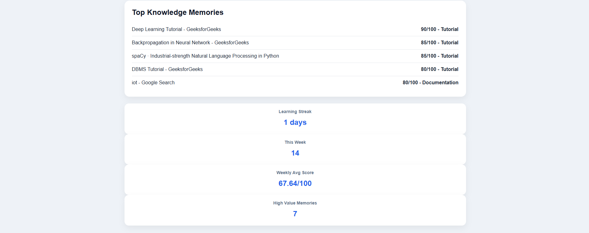
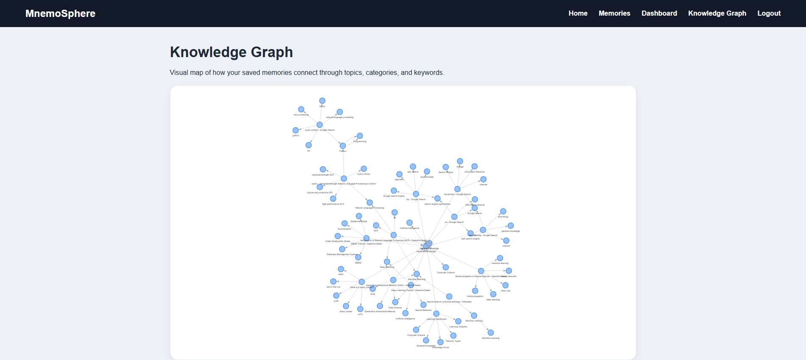
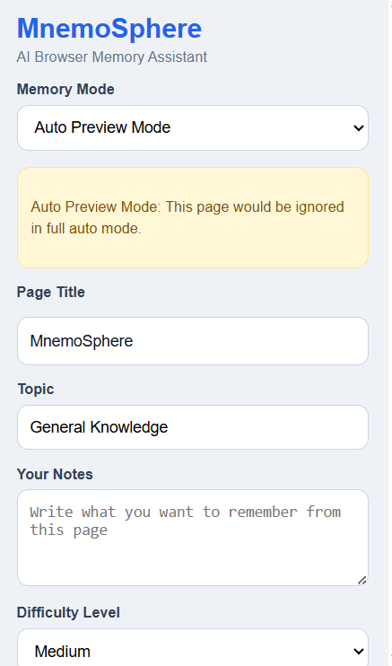
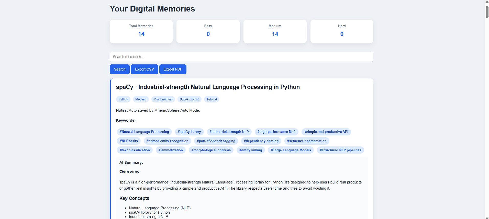
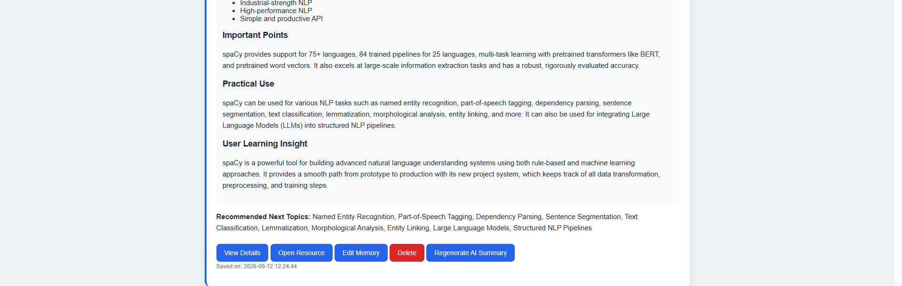

# MnemoSphere 🧠

## AI-Powered Digital Memory & Learning Intelligence System

MnemoSphere is an AI-powered personal knowledge management system that helps users capture, organize, analyze, and revisit learning resources from across the web.

The platform combines Artificial Intelligence, Learning Analytics, Browser Automation, and Knowledge Graphs to create a personalized learning companion.

---

## Key Features

### User Authentication

* Secure Signup & Login
* OTP-based Login
* Password Reset via Email

### AI Memory Engine

* Save webpages as memories
* AI-generated structured summaries
* Knowledge score evaluation
* Memory type classification
* Recommended next learning topics
* Duplicate memory detection

### Browser Intelligence

* Chrome Extension Integration
* Manual Save Mode
* Suggest Mode
* Auto Save Mode

### Learning Analytics

* Learning Dashboard
* Learning Streak Tracking
* Weekly Learning Statistics
* High Value Memory Analysis
* Knowledge Distribution Analysis

### Knowledge Graph

* Visual connection between:

  * Memories
  * Topics
  * Categories
  * Keywords

### AI Learning Assistant

* Question Answering from Saved Memories
* Personalized Knowledge Retrieval
* Learning Pattern Analysis

---

## Tech Stack

### Backend

* Python
* Flask
* SQLite

### Frontend

* HTML
* CSS
* JavaScript

### AI

* Groq API
* Llama 3.1 8B Instant

### Browser Extension

* Chrome Extension APIs

### Data Processing

* BeautifulSoup
* Requests

---

## Project Architecture

User → Chrome Extension → Flask Backend → AI Engine → Database

↓

Learning Analytics Dashboard

↓

Knowledge Graph & Memory Retrieval

---

## Future Enhancements

* AI Learning Profile
* Weekly Learning Reports
* Semantic Memory Clustering
* Personalized Learning Recommendations
* Multi-device Synchronization

---
## Screenshots

### Home Page

Main landing page of MnemoSphere featuring AI-powered search, authentication, and quick navigation to core learning features.

### Memories Dashboard

Central memory repository displaying saved resources, AI-generated summaries, knowledge scores, memory types, and recommended learning topics.

### Knowledge Graph

Interactive visualization showing relationships between memories, topics, categories, and keywords for better knowledge discovery.

### Chrome Extension

Browser extension that enables Manual Mode, Suggest Mode, and Auto Mode for intelligent webpage capture and memory creation.

### Memory Details

Detailed memory view containing structured AI notes, keywords, educational insights, difficulty level, and learning recommendations.

## Author

Akshaya Gurajala

B.Tech Computer Science & Engineering

Adikavi Nannaya University

## Live Demo
https://mnemosphere.onrender.com

